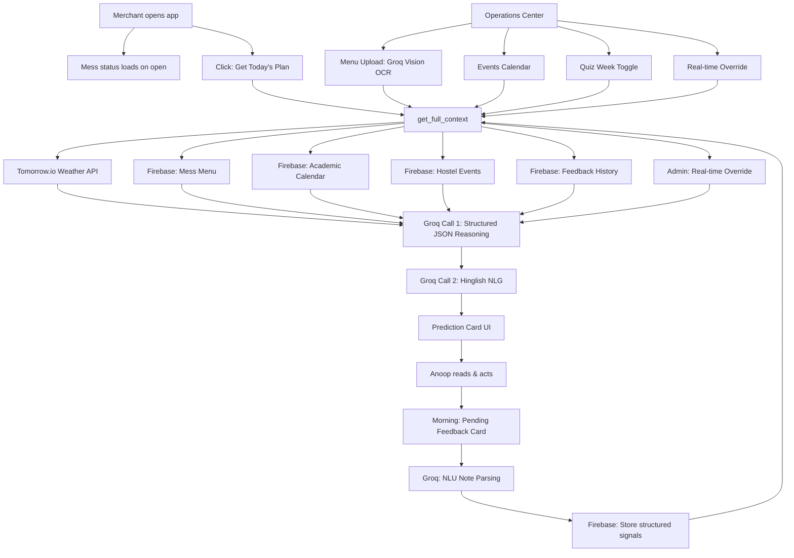

# DayCue — AI Demand Signals for Campus Canteens

> **Top 1% · OkCredit Future Founders 2026 · 150+ campuses · 1,000+ participants**

DayCue predicts daily demand for campus canteen owners **before the rush hits** — using live weather, mess menu quality, academic calendar, hostel events, and merchant feedback history. Built for Anoop, owner of Hall 12 canteen at IIT Kanpur.

**Live app:** [canteen-ai-production.up.railway.app](https://canteen-ai-production.up.railway.app)

---

## The Problem

Anoop runs Hall 12 canteen serving 400+ students daily from 2pm to 2am. Every stocking decision was pure gut feel. On high-rush nights he ran out — turning away 10-15 students per rush. Those students told friends *"canteen mein khaana khatam ho gaya"* — a word-of-mouth loop that suppressed entire group visits. On slow nights, ₹200-300 of raw ingredients went to waste weekly.

**The Wednesday Validation — July 1st, 2026**

DayCue predicted 65% rain probability in the morning. By 3pm the sky looked completely clear. Anoop stocked extra samosas and fritters anyway. Rain came in the evening. Result: **50-60% more evening snack sales** than on any previous unwarned rainy evening.

> *"Maine morning mein dekha tha ki aaj barish hoga, fir dopahar mein laga nahi ki hogi — fir shaam ko barish hui to kafi acha sales hua."*
> — Anoop, Hall 12 Canteen Owner

---

## How It Works

DayCue fuses **6 simultaneous signals** through two chained Groq LLM calls on every prediction:

### Signal Pipeline

| Signal | Source | Method |
|--------|--------|--------|
| Live weather | Tomorrow.io API | Hyperlocal Kanpur forecast |
| Mess menu quality | Uploaded PDF/image | Groq vision OCR extraction |
| Academic calendar | Firebase | Exam weeks, holidays |
| Hostel events | Admin panel | Manual entry |
| Quiz week status | Toggle | Firebase flag |
| Merchant feedback | Firebase Firestore | Daily 1-5 ratings + NLU parsing |

### Two-Call LLM Architecture

```
User clicks predict
        ↓
Call 1 — Structured Reasoning (llama-3.3-70b-versatile)
Input: all 6 signals as context
Output: JSON {footfall_level, busiest_slot, top_items,
              confidence, weather_factor, mess_factor,
              academic_factor, reasoning, practical_tip}
        ↓
Call 2 — Hinglish NLG (llama-3.3-70b-versatile)
Input: structured JSON from Call 1
Output: operational Hinglish message for Anoop
        ↓
Displayed to merchant with:
- HIGH RUSH / NORMAL RUSH / LOW RUSH badge
- Peak time window
- Items to prepare
- Why this forecast? (expandable)
- Tip for today
- Operational Hinglish message
```

### Closed-Loop Feedback Architecture

```
Anoop rates prediction (1-5) next morning
        ↓
Groq NLU parses Hindi notes
("samosa khatam ho gaya" → {stockout_item: "samosa"})
        ↓
Structured signals saved to Firebase
        ↓
Fed into next day's prediction context
        ↓
Accuracy improves over time (70% → 84% over 3 weeks)
```

---

## Architecture Diagram



---

## Key Features

### For the Merchant
- **Daily demand prediction** — HIGH RUSH / NORMAL RUSH / LOW RUSH with peak time
- **Why this forecast?** — expandable Hinglish explanation of reasoning
- **Prepare more of** — specific items to stock before rush
- **Weather chip** — live Kanpur conditions (condition · rain probability)
- **Pending feedback card** — rate yesterday before getting today
- **Accuracy tracker** — weekly graph showing prediction improvement

### For the Admin (Operations Center)
- **Today tab** — real-time override text field with apply/undo
- **Menu tab** — upload mess menu PDF/image, Groq vision extracts weekly schedule
- **Calendar tab** — quiz week toggle, hostel events with impact level
- **Updates tab** — active overrides with edit/remove

### AI-Native Features
- Two-call structured reasoning + natural language generation pipeline
- Groq vision OCR for mess menu PDF extraction
- Hindi note parsing via Groq NLU (extracts structured stockout signals)
- Sudden weather change detection (compares yesterday vs today)
- In-context learning via feedback history injection

---

## Tech Stack

| Layer | Technology |
|-------|-----------|
| Backend | Python Flask |
| AI — Text | Groq API · llama-3.3-70b-versatile |
| AI — Vision | Groq API · llama-4-scout-17b-16e-instruct |
| Weather | Tomorrow.io API |
| Database | Firebase Firestore |
| Deployment | Railway |
| Frontend | HTML · CSS · JavaScript (single file) |
| Fonts | Inter · Manrope |

---

## Results

| Metric | Value |
|--------|-------|
| Consecutive days of usage | 13 days |
| Overall prediction accuracy | 80% |
| Week 1 accuracy | 70% (avg 3.5/5) |
| Week 3 accuracy | 84% (avg 4.2/5) |
| Wednesday rain surge | 50-60% more evening snack sales |
| Usage timing shift | 7-8pm → 1-2pm pre-rush (habit formed) |

---

## Project Structure

```
canteen-ai/
├── app.py                  # Flask backend — all routes and AI logic
├── templates/
│   └── index.html          # Complete frontend (single file)
├── static/
│   ├── logo.png            # Green logo for light backgrounds
│   └── logo_white.png      # White inverted logo for green header
├── requirements.txt
├── .env                    # Local environment variables (gitignored)
├── firebase-credentials.json  # Firebase service account (gitignored)
└── Procfile                # Railway deployment config
```

---

## Local Setup

### Prerequisites
- Python 3.9+
- Firebase project with Firestore enabled
- Groq API key (free at console.groq.com)
- Tomorrow.io API key (free at tomorrow.io)

### Installation

```bash
git clone https://github.com/princeyadav14/canteen-ai
cd canteen-ai
pip install -r requirements.txt
```

### Environment Variables

Create a `.env` file in the root directory:

```env
GROQ_API_KEY=your_groq_api_key
FIREBASE_CREDENTIALS_B64=your_base64_encoded_firebase_credentials
TOMORROW_API_KEY=your_tomorrow_io_api_key
```

**Getting FIREBASE_CREDENTIALS_B64:**

```bash
# Mac/Linux
base64 -i firebase-credentials.json

# Windows PowerShell
[Convert]::ToBase64String([IO.File]::ReadAllBytes("firebase-credentials.json"))
```

Paste the output as the value of `FIREBASE_CREDENTIALS_B64`.

### Run

```bash
python app.py
```

Open `http://127.0.0.1:5000` in your browser.

---

## Deployment (Railway)

1. Push code to GitHub
2. Connect repo to Railway
3. Add environment variables in Railway → Variables:
   - `GROQ_API_KEY`
   - `FIREBASE_CREDENTIALS_B64`
   - `TOMORROW_API_KEY`
4. Railway auto-deploys on every push to main

---

## Firebase Structure

```
canteen/
├── feedback/
│   └── history[]           # date, day, score, predicted_level, note, parsed_note
├── mess_menu/              # Uploaded menu with dinner_quality per day
├── mess_menu_backup/       # Previous menu for revert
├── events/                 # Hostel events + quiz_week_active flag
├── weather_history/        # Yesterday's weather for change detection
└── usage_log/
    └── sessions/           # Every predict click: device, IP, timestamp (IST)
```

---

## Key Learnings

1. **Talk to merchants before building** — every Week 1 assumption was wrong. The conversations corrected them.
2. **Ship broken and fix publicly** — correcting errors in front of Anoop built more trust than a polished prototype.
3. **Retention mechanic is the product** — the morning pending card (rate yesterday to get today) drives the habit, not the prediction.
4. **Politeness is not adoption** — one correct prediction on a surprising day builds more trust than two weeks of routine accuracy.
5. **Weather affects what Indian campus merchants stock, not whether customers come** — both mess and canteen are inside the hostel. Rain means chai and samosa, not fewer customers.

---

## What's Next

- **Quantified predictions** — move from "HIGH RUSH" to "prep 40 extra samosas" (needs 4-6 weeks footfall data)
- **Student survey** — replace observation-based behavioral patterns with validated data from Hall 12 residents
- **Multi-canteen expansion** — same architecture, different mess menus and event calendars per hostel
- **Model migration** — transition to Groq's recommended replacements as Llama models deprecate

---

## Contributing

Pull requests are welcome. For major changes please open an issue first.

1. Fork the repo
2. Create a feature branch (`git checkout -b feature/your-feature`)
3. Commit changes (`git commit -m 'Add your feature'`)
4. Push to branch (`git push origin feature/your-feature`)
5. Open a Pull Request

---

## License

MIT

---

## Acknowledgements

- **Anoop** — Hall 12 canteen owner, IIT Kanpur — for 13 consecutive days of honest feedback
- **OkCredit** — for the Future Founders 2026 programme
- **Groq** — for fast LLM inference
- **Tomorrow.io** — for hyperlocal Kanpur weather data

---

*Built by [Prince Yadav](https://github.com/princeyadav14) · IIT Kanpur · 2026*
